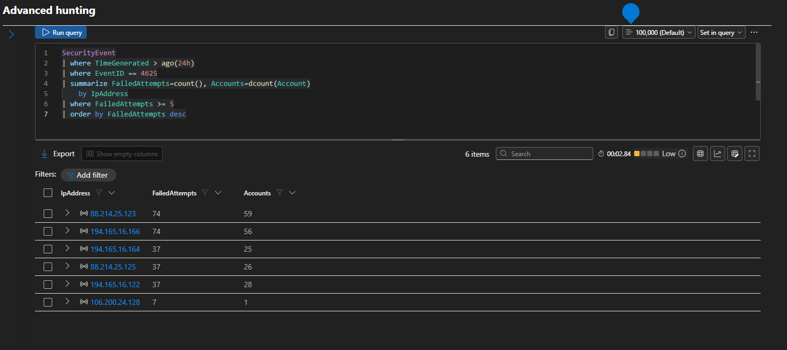

# Multiple Failed Logins Detection Rule

## Overview

This Analytics Rule detects repeated failed Windows authentication attempts that may indicate a brute-force password attack against one or more user accounts.

The rule monitors Windows Security Event ID 4625 and generates an incident when the number of failed logons exceeds a predefined threshold within a short period.

---

## Objective

- Detect brute-force login attempts
- Identify targeted user accounts
- Reduce manual log monitoring
- Generate incidents automatically

---

## Data Source

- Microsoft Sentinel
- Windows Security Events
- Log Analytics Workspace

---

## Event ID

- 4625 – Failed Logon

---

## Detection Logic

The Analytics Rule runs a KQL query that counts failed authentication events grouped by account name and source IP address.

If more than five failed logon attempts are detected, an incident is automatically created.

---

## Expected Outcome

The rule helps analysts quickly identify accounts that are experiencing repeated authentication failures before a successful compromise occurs.

---

## MITRE ATT&CK

| Technique | ID |
|-----------|----|
| Brute Force | T1110 |

---

## Investigation Steps

1. Review the generated incident.
2. Identify the source IP address.
3. Check affected user accounts.
4. Verify whether successful logons occurred after the failed attempts.
5. Determine whether additional response actions are required.

---

## Evidence

### Related KQL Query:

[Multiple-Failed-Logins](../kql/Failed Attempts Greater Than 5.md)

### Screenshot:

---

## Conclusion

This rule successfully detected repeated failed authentication attempts and generated a Microsoft Sentinel incident for further investigation.