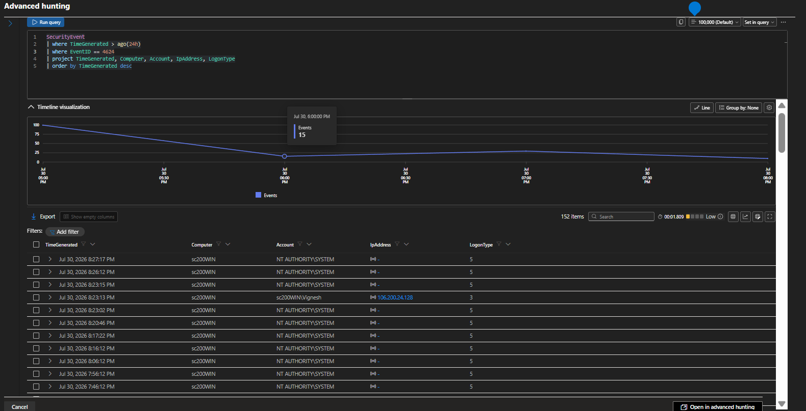

# Successful Logon Detection Rule

## Overview

This Analytics Rule monitors successful Windows authentication events to establish a baseline of legitimate user activity.

Successful authentication events are useful when correlating failed login attempts and validating account access.

---

## Objective

- Monitor successful user logins
- Establish authentication baseline
- Support incident investigations
- Correlate successful and failed authentication events

---

## Data Source

- Microsoft Sentinel
- Windows Security Events

---

## Event ID

- 4624 – Successful Logon

---

## Detection Logic

The Analytics Rule collects successful authentication events and records important information such as username, computer name, source IP address, and logon type.

---

## Expected Outcome

Security analysts can quickly verify whether an account successfully authenticated following multiple failed login attempts.

---

## MITRE ATT&CK

| Technique | ID |
|-----------|----|
| Valid Accounts | T1078 |

---

## Investigation Steps

1. Identify authenticated user.
2. Review source IP address.
3. Verify authentication time.
4. Compare with previous failed logons.
5. Validate whether access is expected.

---

## Evidence

Related KQL Query

- kql/Successful-Logons.md

### Screenshot

---

## Conclusion

Successful authentication events provide important context during incident investigations and help distinguish legitimate activity from malicious behavior.