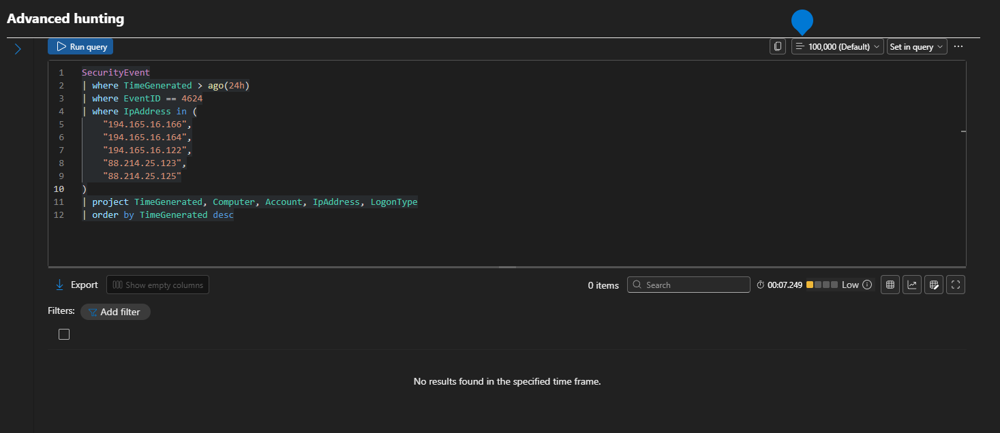

# Suspicious IP Detection Rule

## Overview

This Analytics Rule identifies authentication activity originating from IP addresses that demonstrate suspicious behavior, including repeated failed logon attempts.

The rule helps analysts focus on potentially malicious external hosts attempting unauthorized access.

---

## Objective

- Detect suspicious IP activity
- Support threat hunting
- Identify repeated authentication failures
- Improve investigation efficiency

---

## Data Source

- Microsoft Sentinel
- Windows Security Events

---

## Event IDs

- 4625 – Failed Logon
- 4624 – Successful Logon

---

## Detection Logic

The rule analyzes authentication events from individual IP addresses and highlights those with abnormal authentication behavior.

The results can be correlated with successful logons to determine whether an attack was successful.

---

## Expected Outcome

Analysts can quickly identify suspicious IP addresses and investigate authentication activity associated with those systems.

---

## MITRE ATT&CK

| Technique | ID |
|-----------|----|
| Brute Force | T1110 |
| Valid Accounts | T1078 |

---

## Investigation Steps

1. Identify suspicious IP address.
2. Review failed authentication attempts.
3. Check for successful logons.
4. Investigate targeted accounts.
5. Document findings.

---

## Evidence

Related KQL Query

### Screenshot

---

## Conclusion

This Analytics Rule improves visibility into suspicious authentication activity and assists analysts in detecting potential brute-force attacks.