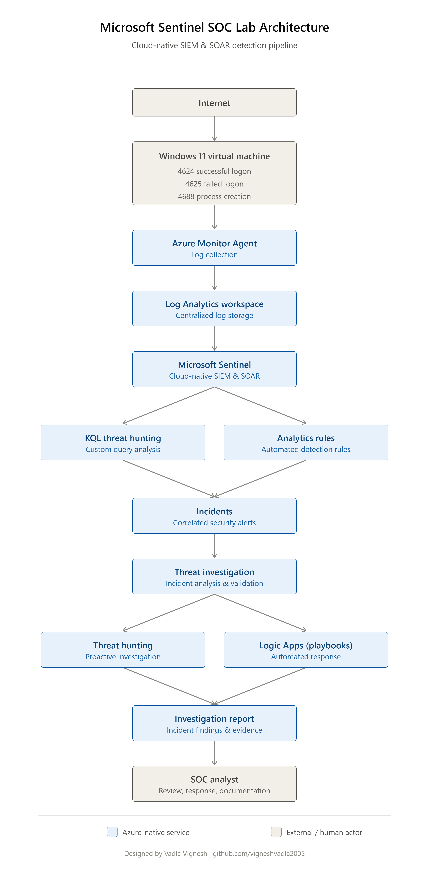

# Microsoft Sentinel SOC Lab Architecture

## Overview

The lab was designed to simulate a basic Security Operations Center (SOC) environment using Microsoft Sentinel. Windows Security Events generated inside a virtual machine were collected, analyzed, and investigated through Microsoft Sentinel.

The objective was to understand how security events move through the Microsoft security ecosystem before becoming incidents for investigation.

---

## Architecture Components

### Windows 11 Virtual Machine

The Windows virtual machine acted as the endpoint where authentication and process creation events were generated.

Collected Event IDs:

- 4624 – Successful Logon
- 4625 – Failed Logon
- 4688 – Process Creation

---

### Azure Monitor Agent

Azure Monitor Agent (AMA) collected Windows Security Events and forwarded them to Azure Log Analytics.

---

### Log Analytics Workspace

The Log Analytics Workspace served as the central repository for all collected Windows Security Events.

It also provided the data source used by Microsoft Sentinel.

---

### Microsoft Sentinel

Microsoft Sentinel analyzed incoming logs, executed Analytics Rules, and generated security incidents for investigation.

---

### Investigation Process

After incidents were generated, KQL queries were used to:

- Validate alerts
- Investigate authentication events
- Identify suspicious IP addresses
- Review event timelines
- Document findings

---

## Architecture Diagram

The complete architecture diagram is available in:

---

## Summary

This architecture demonstrates how Microsoft Sentinel collects, detects, investigates, and documents Windows security events in a cloud-native SIEM environment.