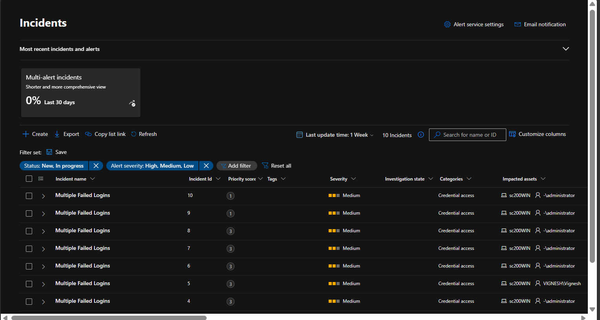
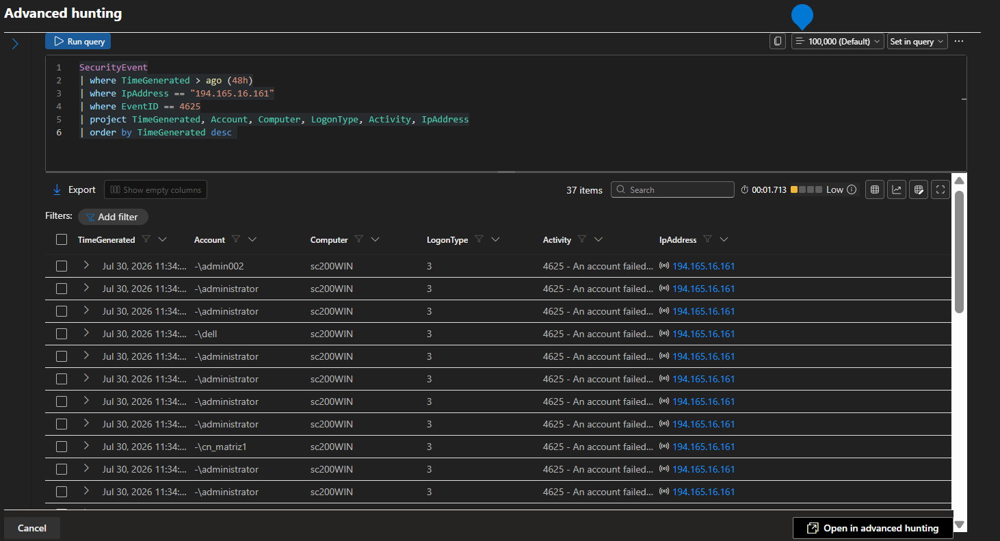

# Incident 01 - Brute Force Authentication Attempt

## Incident Summary

During routine monitoring in Microsoft Sentinel, multiple failed authentication attempts were detected against several Windows user accounts. The activity exceeded the configured Analytics Rule threshold, resulting in an incident being generated automatically.

---

## Alert Information

**Incident Name:** Multiple Failed Logins

**Severity:** Medium

**Detection Source:** Microsoft Sentinel Analytics Rule

**Data Source:** Windows Security Events

---

## Initial Assessment

The authentication failures originated from a single external IP address and targeted multiple user accounts within a short period.

No evidence of privilege escalation or malware execution was observed during the initial investigation.

---

## Investigation Steps

1. Opened the generated incident in Microsoft Sentinel.
2. Reviewed all related security alerts.
3. Identified the source IP address.
4. Examined failed logon events (Event ID 4625).
5. Compared activity with successful logons (Event ID 4624).
6. Reviewed process creation events (Event ID 4688).
7. Verified the event timeline.

---

## Findings

- Multiple failed authentication attempts detected.
- Same IP address targeted multiple accounts.
- No successful compromise identified.
- Activity matched a brute-force login pattern.

---

## MITRE ATT&CK

| Technique | ID |
|-----------|----|
| Brute Force | T1110 |

---

## Evidence

### KQL Queries

### Screenshots

---

## Final Assessment

The activity was identified as a brute-force authentication attempt. The incident was documented for monitoring and future analysis.