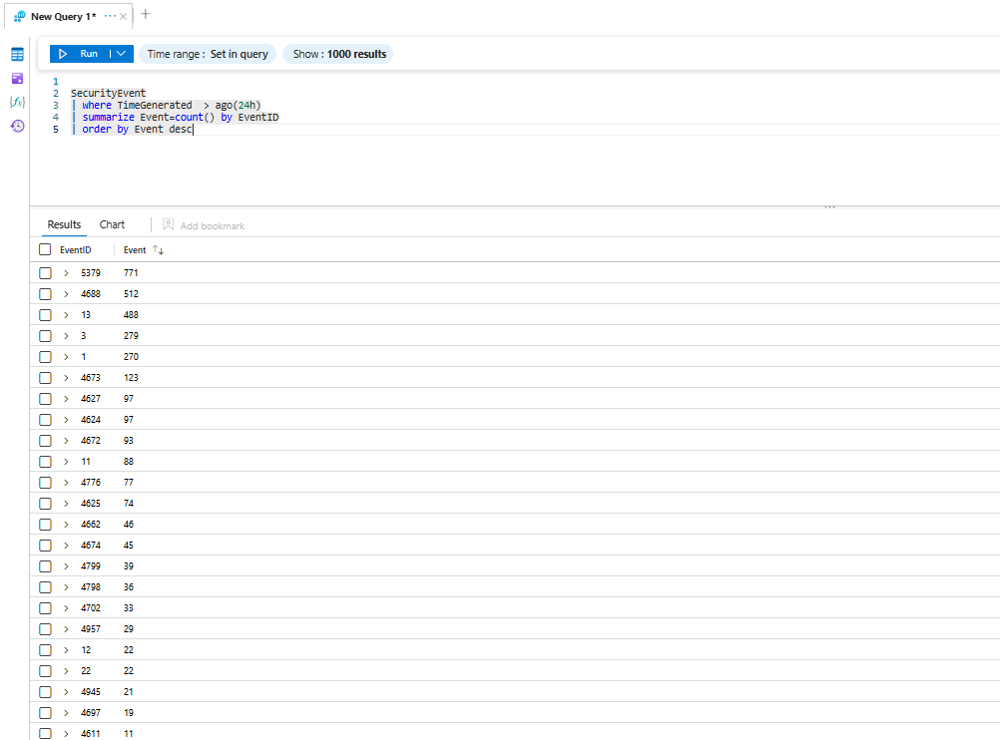

# Event Count Results

## Purpose

This query was used to validate Windows Security Event collection by reviewing the number of events captured during the previous 24 hours.

## KQL Query

```kusto
SecurityEvent
| where TimeGenerated > ago(24h)
| summarize EventCount=count() by EventID
```

## Evidence



## Notes

The results confirmed that Windows Security Events were successfully collected and available for further threat hunting and incident investigation.