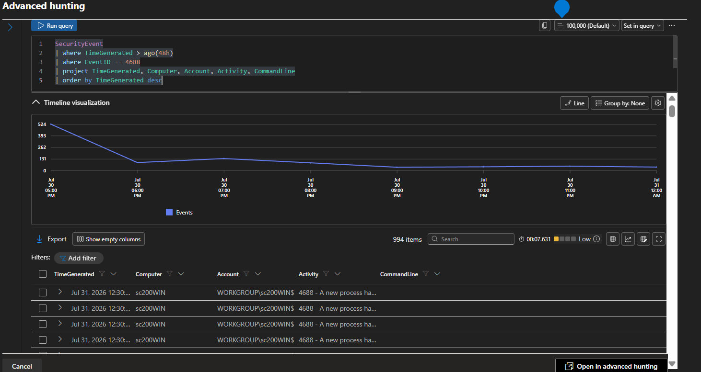

# Process Creation Monitoring

## Purpose

This query searches Windows Security Event ID **4688**, which records the creation of new processes.

Monitoring process creation events helps identify suspicious commands, unauthorized applications, and potential malicious activity on Windows systems.


## Detection Logic

- Search Windows Security Events
- Filter Event ID 4688
- Display recently created processes
- Review process execution details


## KQL Query

```kusto
SecurityEvent
| where TimeGenerated > ago(24h)
| where EventID == 4688
| project TimeGenerated, Computer, Account, NewProcessName, ParentProcessName, CommandLine
| order by TimeGenerated desc
```


## Query Explanation

This query retrieves Windows process creation events recorded in the Security log.

The results include the account responsible for launching the process, the process name, parent process, computer, and timestamp.

Monitoring these events helps identify unexpected applications or suspicious command execution.


## Expected Output

The query lists recently created processes together with the user account, process name, parent process, and execution time.

These events support investigations involving malware execution, privilege escalation, or suspicious command-line activity.


## MITRE ATT&CK Mapping

| Technique | ID |
|-----------|----|
| Command and Scripting Interpreter | T1059 |
| System Information Discovery | T1082 |


## Evidence 

### Screenshot:



## Analyst Notes

During the lab, process creation events were collected successfully and used to verify that Windows Security Logs were being ingested into Microsoft Sentinel.

These events provide valuable context when investigating suspicious system activity.